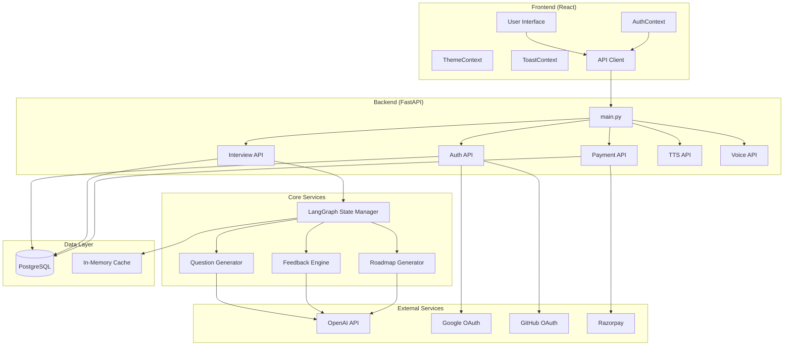
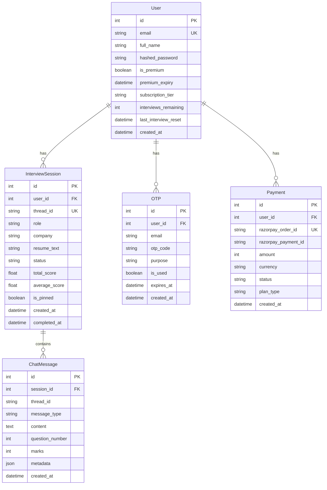
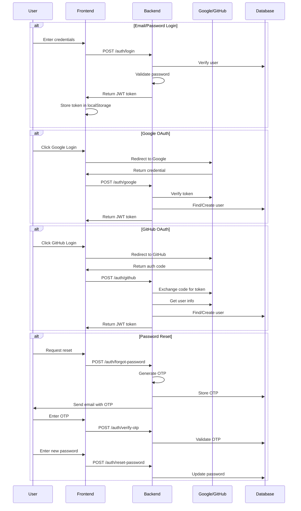
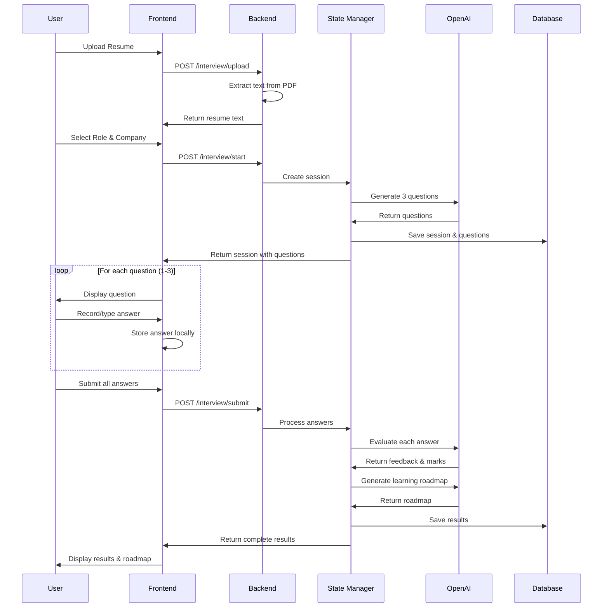
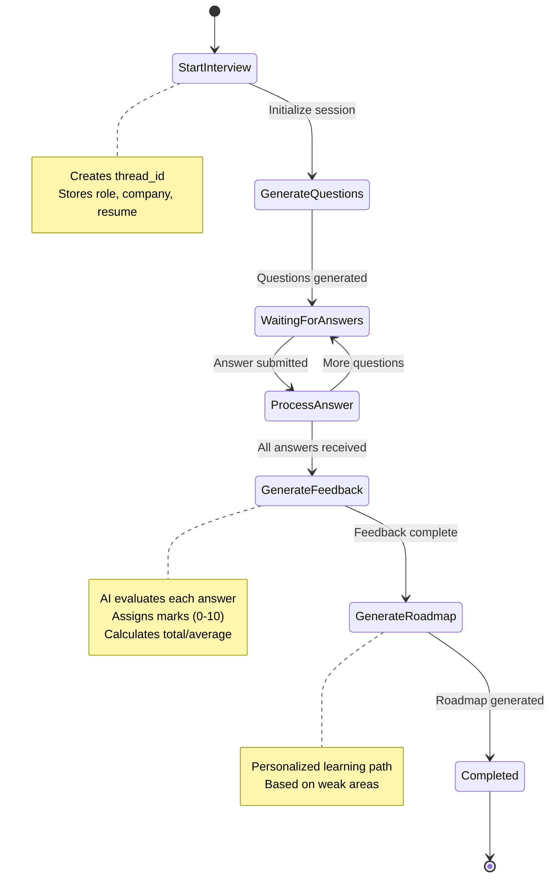
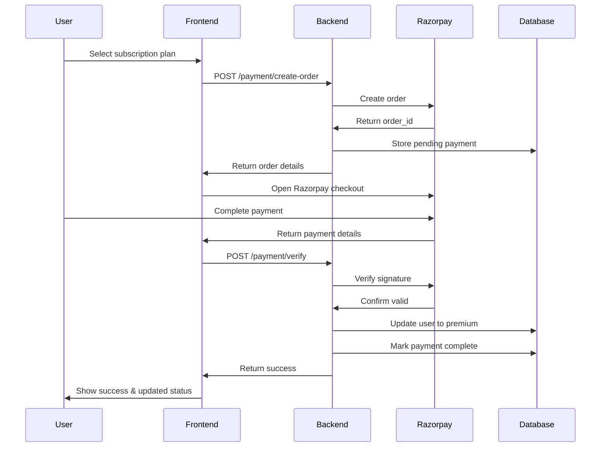
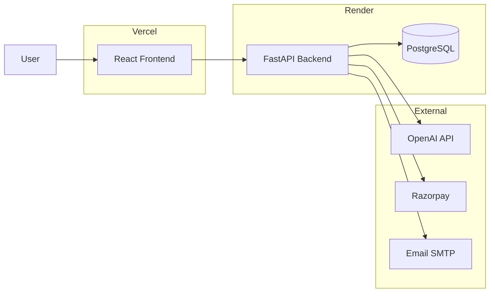

# AI Interviewer - Architecture & Flow Documentation

## Overview

AI Interviewer is a full-stack application that provides AI-powered mock interviews with personalized feedback. The system uses LangGraph for state management, OpenAI for question generation and evaluation, and supports multiple authentication methods.

---

## Tech Stack

| Layer | Technology |
|-------|------------|
| **Frontend** | React 18, React Router, Vercel Analytics |
| **Backend** | FastAPI, SQLAlchemy, Pydantic |
| **AI/ML** | LangGraph, OpenAI GPT, LangChain |
| **Database** | PostgreSQL (Production), SQLite (Dev) |
| **Authentication** | JWT, OAuth 2.0 (Google, GitHub) |
| **Payments** | Razorpay |
| **Deployment** | Vercel (Frontend), Render (Backend) |

---

## System Architecture



---

## Database Schema



---

## Authentication Flow



---

## Interview Flow



---

## LangGraph State Machine



---

## Payment Flow



---

## Frontend Routing

| Route | Component | Protected | Description |
|-------|-----------|-----------|-------------|
| `/` | Home | No | Landing page with interview start form |
| `/interview` | Interview | Yes | Active interview session |
| `/results` | Result | Yes | Interview results & feedback |
| `/dashboard` | Dashboard | Yes | User analytics & stats |
| `/history` | ChatHistory | Yes | Past interview sessions |
| `/pinned` | PinnedResults | Yes | Saved interviews |
| `/leaderboard` | Leaderboard | No | Top performers |
| `/pricing` | Pricing | No | Subscription plans |
| `/settings` | Settings | Yes | User settings |
| `/about` | About | No | About page |
| `/help` | Help | No | FAQ & guides |
| `/contact` | ContactUs | No | Contact form |

---

## API Endpoints

### Authentication (`/auth`)
| Method | Endpoint | Description |
|--------|----------|-------------|
| POST | `/signup` | Create new account |
| POST | `/login` | Email/password login |
| POST | `/google` | Google OAuth |
| POST | `/github` | GitHub OAuth |
| GET | `/me` | Get current user |
| POST | `/forgot-password` | Request OTP |
| POST | `/verify-otp` | Verify OTP |
| POST | `/reset-password` | Set new password |

### Interview (`/interview`)
| Method | Endpoint | Description |
|--------|----------|-------------|
| POST | `/upload` | Upload resume PDF |
| POST | `/start` | Start new interview |
| POST | `/submit` | Submit all answers |
| GET | `/sessions` | List user's sessions |
| GET | `/session/{id}` | Get session details |
| GET | `/session/{id}/history` | Get chat history |
| DELETE | `/session/{id}` | Delete session |
| POST | `/session/{id}/pin` | Pin session |
| DELETE | `/session/{id}/pin` | Unpin session |
| GET | `/analytics` | User analytics |
| GET | `/leaderboard` | Top performers |

### Payment (`/payment`)
| Method | Endpoint | Description |
|--------|----------|-------------|
| GET | `/plans` | Get pricing plans |
| POST | `/create-order` | Create Razorpay order |
| POST | `/verify` | Verify payment |
| GET | `/status` | Subscription status |
| POST | `/cancel` | Cancel subscription |
| GET | `/history` | Payment history |

---

## Key Components

### Backend Services

| Service | File | Purpose |
|---------|------|---------|
| State Manager | `state_manager.py` | LangGraph workflow for interviews |
| Generator | `generator.py` | Question generation using OpenAI |
| Feedback | `feedback.py` | Answer evaluation and scoring |
| Roadmap | `roadmap.py` | Learning path generation |
| Cache | `cache.py` | In-memory caching |
| Email | `email_utils.py` | OTP email sending |

### Frontend Contexts

| Context | Purpose |
|---------|---------|
| `AuthContext` | User authentication state & methods |
| `ThemeContext` | Dark/light mode toggle |
| `ToastContext` | Notification system |

---

## Subscription Tiers

| Feature | Free | Premium |
|---------|------|---------|
| Interviews/month | 3 | Unlimited |
| Question types | Basic | Advanced |
| Detailed feedback | ❌ | ✅ |
| Learning roadmap | ❌ | ✅ |
| Analytics dashboard | Limited | Full |
| Priority support | ❌ | ✅ |

---

## Environment Variables

### Backend
```
DATABASE_URL=postgresql://...
SECRET_KEY=your-secret-key
OPENAI_API_KEY=sk-...
GOOGLE_CLIENT_ID=...
GITHUB_CLIENT_ID=...
GITHUB_CLIENT_SECRET=...
RAZORPAY_KEY_ID=...
RAZORPAY_KEY_SECRET=...
SMTP_HOST=smtp.gmail.com
SMTP_PORT=587
SMTP_USER=...
SMTP_PASSWORD=...
```

### Frontend
```
REACT_APP_API_URL=https://api.example.com
REACT_APP_GOOGLE_CLIENT_ID=...
REACT_APP_GITHUB_CLIENT_ID=...
REACT_APP_RAZORPAY_KEY_ID=...
```

---

## Deployment Architecture



---

## File Structure

```
Interviewer/
├── backend/
│   ├── api/
│   │   ├── auth.py          # Authentication endpoints
│   │   ├── interview.py     # Interview CRUD operations
│   │   ├── interview_v2.py  # Enhanced interview API
│   │   ├── payment.py       # Razorpay integration
│   │   ├── tts.py           # Text-to-speech
│   │   └── voice.py         # Voice processing
│   ├── migrations/          # Alembic migrations
│   ├── schemas/             # Pydantic schemas
│   ├── main.py              # FastAPI application
│   ├── models.py            # SQLAlchemy models
│   ├── database.py          # Database connection
│   ├── state_manager.py     # LangGraph workflow
│   ├── generator.py         # Question generation
│   ├── feedback.py          # Answer evaluation
│   ├── roadmap.py           # Learning roadmap
│   └── requirements.txt     # Python dependencies
│
├── frontend/
│   ├── src/
│   │   ├── components/      # Reusable UI components
│   │   ├── contexts/        # React contexts
│   │   ├── pages/           # Page components
│   │   ├── services/        # API client services
│   │   ├── hooks/           # Custom hooks
│   │   └── App.js           # Main app component
│   ├── public/              # Static assets
│   └── package.json         # Node dependencies
│
├── ARCHITECTURE.md          # This file
├── README.md                # Getting started guide
└── render.yaml              # Render deployment config
```

---

## Security Features

1. **JWT Authentication** - Stateless token-based auth with 24-hour expiry
2. **Password Hashing** - bcrypt with automatic salt
3. **CORS Configuration** - Whitelist of allowed origins
4. **Security Headers** - X-Frame-Options, X-Content-Type-Options, etc.
5. **OAuth 2.0** - Secure third-party authentication
6. **OTP Verification** - Time-limited codes for password reset
7. **Protected Routes** - Frontend route guards for authenticated pages

---

*Last updated: January 2026*
