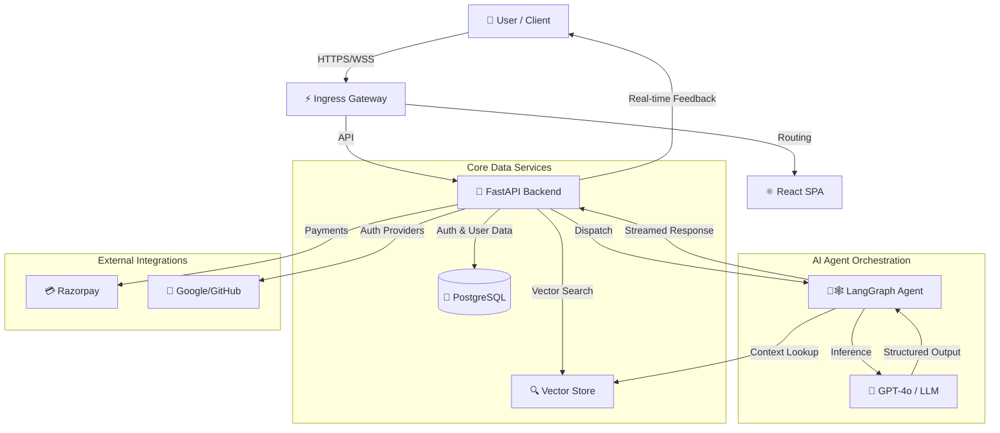

# InterviewForge: The Enterprise AI Ecosystem

A cloud-native Conversational AI solution demonstrating end-to-end expertise in NLP, system architecture, and product delivery.


## 🚀 Project Overview

The **InterviewForge** platform represents a production-ready architecture for scalable, domain-specific conversational agents. It was engineered to address the complex challenge of simulating high-stakes technical interviews with the depth, context, and adaptability of a human expert.

Serving **1000+ monthly active users**, this project serves as a comprehensive demonstration of **Cloud-Based Conversational AI solutions**, bridging the gap between advanced Machine Learning concepts and practical, user-centric business applications.

## 💼 Core Competencies Demonstrated

### 1. Strategic Solution Design & Leadership

- **Executive-Level Problem Solving**: Designed to democratize access to elite technical coaching, translating the ambiguous requirements of valid interview assessment into a concrete, automated scoring system.
- **Customer-Centric Architecture**: Features a "Personalized Roadmap" engine that ensures every user receives a bespoke growth plan, reflecting a deep understanding of user retention and value delivery.
- **Scalable Vision**: Architected for horizontal scaling, supporting a growing user base of over 1000 aspirants without degradation in inference latency or system stability.

### 2. Advanced Conversational AI & NLP

- **Stateful Conversation Management**: Leverages **LangChain & LangGraph** to build deterministic, state-aware conversation flows (_Context -> Question -> Analysis -> Feedback_), ensuring reliability over stochastic LLM behavior.
- **Context-Aware Generation**: Implements a dynamic context engine that ingests user resumes (PDF) to ground the AI's persona, ensuring questions are strictly relevant to the candidate's actual experience.
- **Prompt Engineering**: Utilizes specialized "Interviewer Persona" templates and strict structured output parsing to maintain a professional tone and generate machine-readable feedback data.

### 3. Cloud-Native & Distributed Systems

- **API-First Design**: Built on **FastAPI** with fully asynchronous endpoints, supporting high-concurrency for chat and real-time feedback streams.
- **Secure & Compliant**: Implements industry-standard **JWT authentication** and OAuth2 (Google/GitHub) integration, ensuring data privacy and secure session management.
- **Microservices Ready**: Modular design features separation of concerns (Authentication, Payment, AI Orchestration, Persistence) suitable for containerized cloud deployment (Render/Vercel).

## 🛠 Technical Architecture

The system orchestrates a complex flow of data between the user client, the API gateway, and the deterministic AI agents.



## 💻 Technlogy Stack

- **Backend**: Python 3.10+, FastAPI, SQLAlchemy (Async), Alembic, Pydantic
- **AI/ML**: LangChain, LangGraph, OpenAI API, pdfplumber (Extraction)
- **Frontend**: React 18, Tailwind CSS, Lucide React, Axios
- **Infrastructure**: PostgreSQL (Neon), Render (Backend), Vercel (Frontend)

## 🚀 Live Access & Setup

- **Production Site**: [https://interviewforge.live](https://interviewforge.live)
- **API Documentation**: [https://ai-interviewer-backend.onrender.com/docs](https://ai-interviewer-backend.onrender.com/docs)

### Local Development

```bash
# Backend
git clone https://github.com/Subhashbisnoi/Interviewer.git
cd Interviewer/backend
pip install -r requirements.txt
./start.sh

# Frontend
cd ../frontend
npm install
npm start
```

## Contributing & License

Contributions are welcome. This project is licensed under the MIT License.
